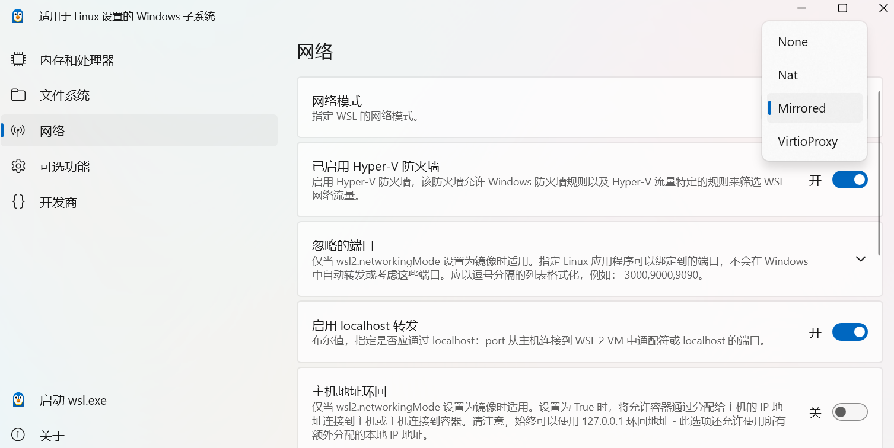
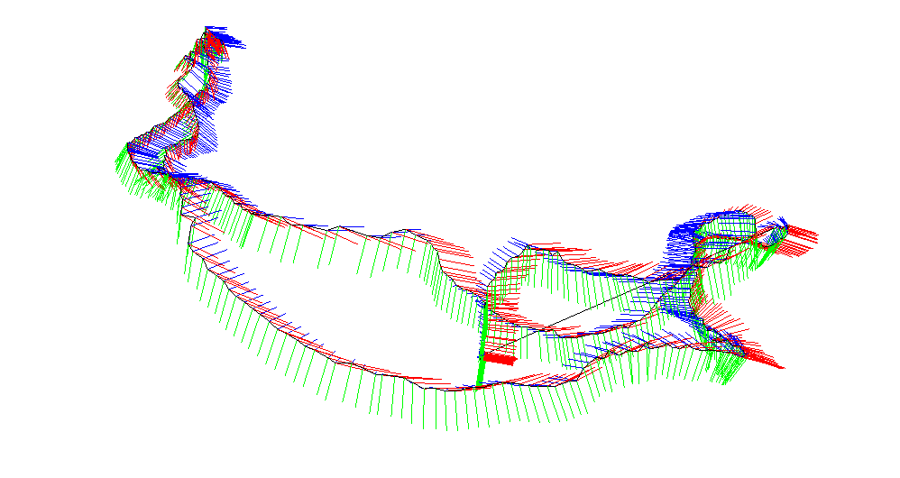
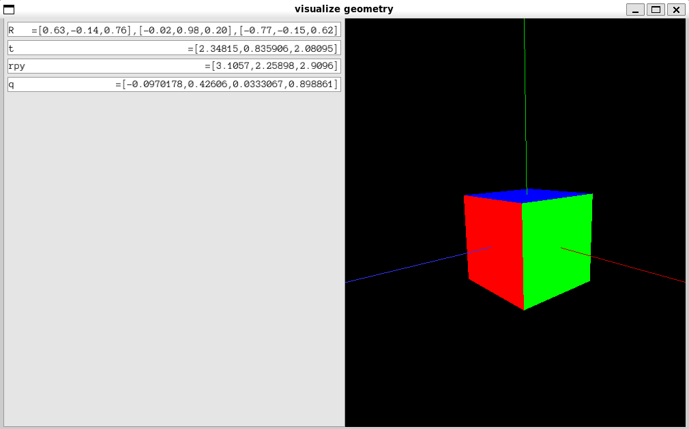
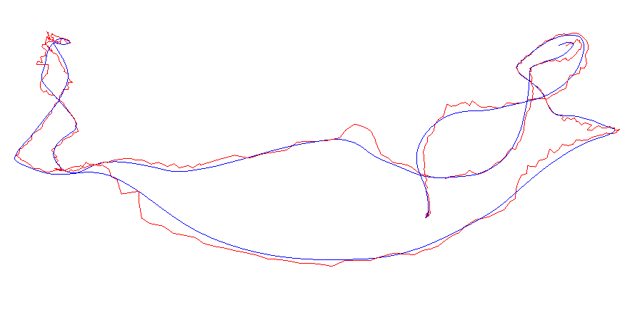
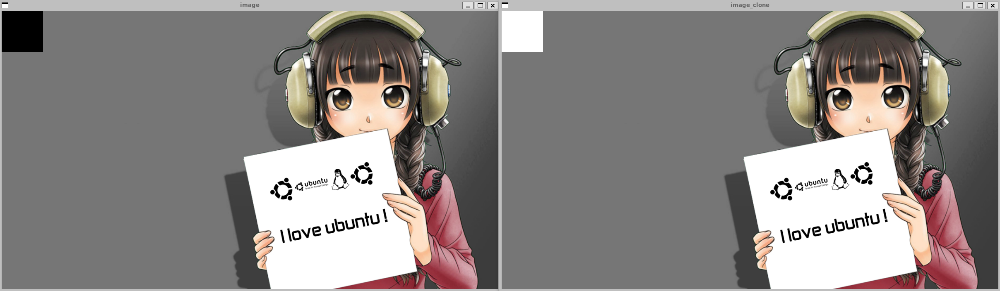
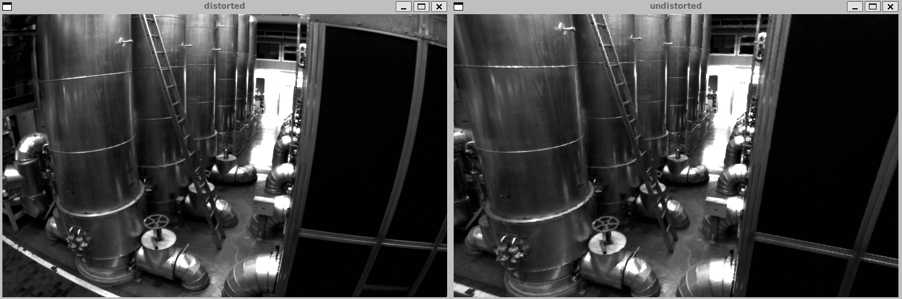
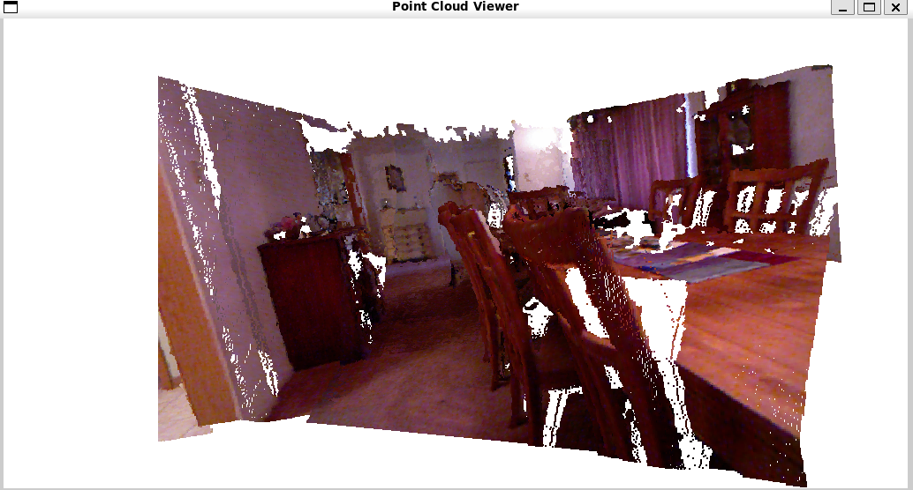
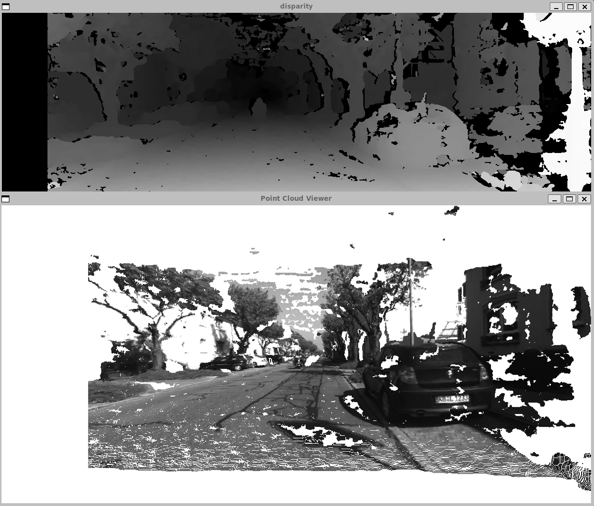

## Introduction

This repository contains my personal learning journey with the book *Visual SLAM: From Theory to Practice* (2nd Edition) by Xiang Gao. Original repository is [here](https://github.com/gaoxiang12/slambook2). (To keep the repository minimal and easy to manage, I created my own instead of forking.)

### Structure

The structure of this repository is as below:

```bash
learn-slambook2
├── .vscode/     # vscode config files
├── assignments/ # the book‘s assignments
├── images/      # demo images
├── slambook2/   # source code of the book
└── README.md    # doc
```

### Overview

**Part Ⅰ: Mathematical Basics**

- ch1: Preliminaries
- ch2: Overview of SLAM
- ch3: Rigid motion in 3D space
- ch4: Lie Group and Lie Algebras
- ch5: Camera models and Image in computers
- ch6: Non-linear optimization

**Part Ⅱ: Practice and Applications**

> [!NOTE]
> Ciallo～ (∠・ω< )⌒★ This part is currently in progress.

- ch7
- ch8
- ch9
- ch10
- ch11
- ch12
- ch13
- ch14

## ENVIRONMENT

- **Development Environment**: WSL2 + VSCode Remote - SSH
- **Operating System**: Ubuntu 20.04 LTS
- **IDE**: Visual Studio Code

## USAGE

Use the below instruction in terminal to clone this repository:

```bash
git clone https://github.com/congyuxiaoyoudao/learn-slambook2.git
```

Download all required submodules:

```bash
cd learn-slambook2
git submodule update --init --recursive
```

> [!TIP]
> If you find it slow to download packages in WSL2, it is recommended to use a proxy server (like clash) and set the network mode to `Mirrored` in your WSL settings.
> ~~Or you can do the above in your host OS and then move them to linux file system wwwwww~~



Then you should configure the development environment, I recommend you to refer to [this](https://zhuanlan.zhihu.com/p/452256687). Once you have done that, you can `cd` to any directory with `CmakeLists.txt` in, and type:

```bash
mkdir build && cd build
cmake ..
make -j4
```

to build and compile programs. Caution, here I always run programs in the `build` directory like `./programname`, so please check the file path in programs in your cases.

## DEMOS

### ch3







### ch5







